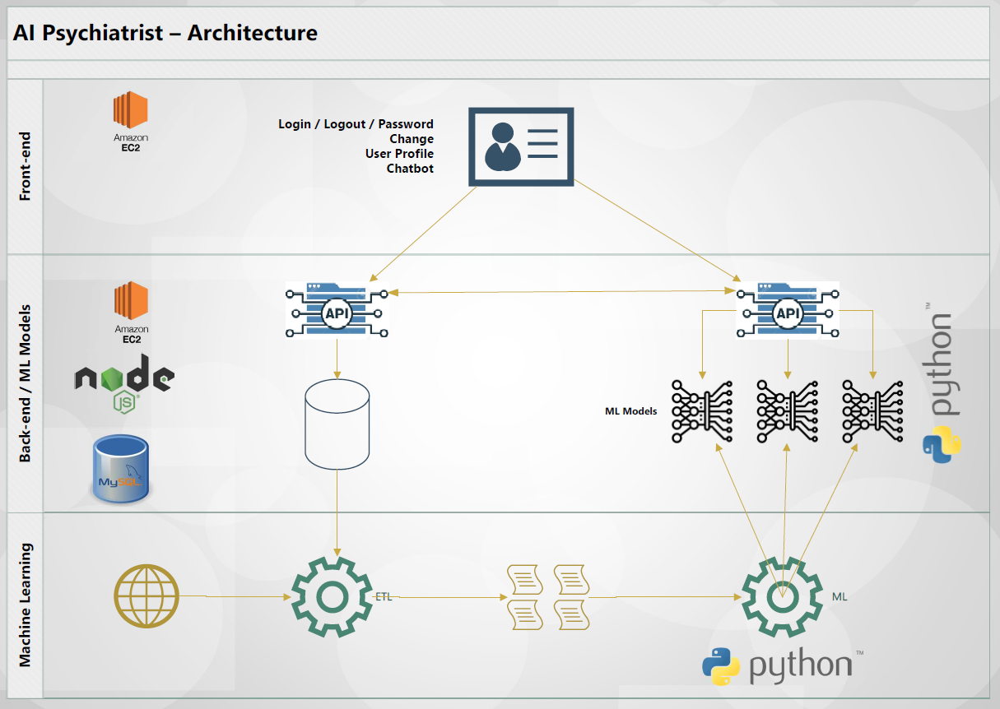
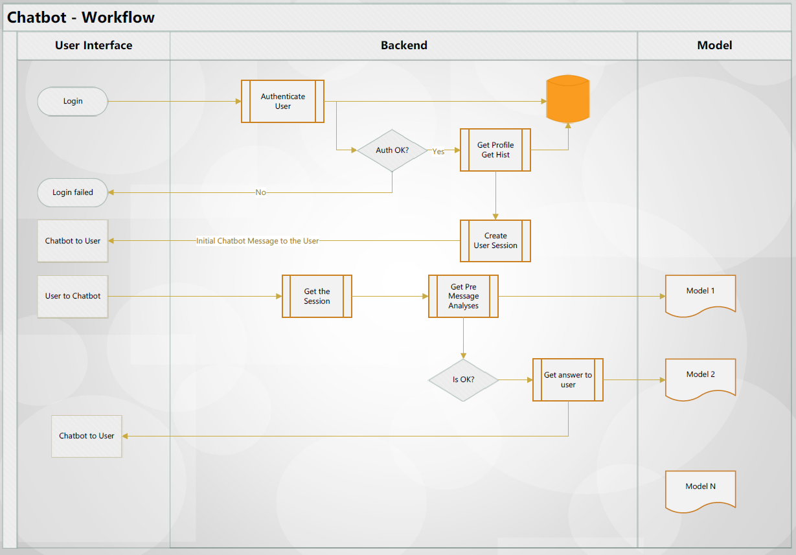

# Generative Mental Health Chatbot

## Overview

The Generative Mental Health Chatbot is a web application developed by our team to provide personalized mental health support and assistance to users. It utilizes a generative model trained on mental health-related data to generate empathetic and supportive responses to user queries and concerns. This project aims to create a user-friendly and effective chatbot that can assist individuals in managing their mental well-being.

## Note

This project is an ongoing endeavor, and the README file will be continuously updated as the project progresses. Please refer to the latest version of the README for the most up-to-date information on the project's features, installation instructions, and usage guidelines.

## Jira Board

For project management and issue tracking, we are utilizing Jira. You can access our Jira board [here](https://aipycoders.atlassian.net/jira/software/projects/AIP/boards/1/roadmap?shared=&atlOrigin=eyJpIjoiMzdiZTQ0ZjUwOThmNDBkMWJmODU3M2RlMzQxYzgwNzMiLCJwIjoiaiJ9).


## Updates

### SPRINT-1

- Added Reddit data gathering: We utilized the Reddit API to gather data from various subreddits. The gathered data has been included in the `datasets` folder. The new data consists of 74,188 rows and 12 columns.
- Added code and data related to Reddit data gathering: You can find the code for gathering Reddit data in the repository. The data is located in the `datasets` folder. The file `subreddit_list.txt` contains the list of subreddits to be searched.
- Added simple backend: We implemented a basic backend for the chatbot. The code for the backend has been added to the repository.
- Broke down EDA file: The EDA file has been divided into two separate files, `EDA.ipynb` and `NLP.ipynb`. The `EDA.ipynb` file contains the code and analysis for Exploratory Data Analysis (EDA) on the new data, which consists of 74,188 rows and 12 columns. The `NLP.ipynb` file focuses on Natural Language Processing (NLP) techniques.
- Conducted EDA on the new data: We performed Exploratory Data Analysis (EDA) on the new data. The code for EDA can be found in the `EDA.ipynb` file. Additionally, we saved the EDA figures in the `graphs` folder.
- Created `config.ini` file: We added a `config.ini` file to securely store API keys. This file has been added to the `.gitignore` to prevent it from being committed to the repository.
- Updated instructions for getting data from Reddit: The README now provides detailed instructions on registering a Reddit app and obtaining client ID and client secret to authenticate API requests. Please refer to the updated instructions for more information.


### SPRINT-2

- Performed NLP preprocessing: We completed all the necessary preprocessing steps for Natural Language Processing (NLP). The preprocessed data file can be found at `datasets/preprocessed_data.csv`.
- Uploaded project architecture and workflow diagrams: Added Architecture.png and Workflow.png for better understanding of the project. Images are in `diagrams` folder.
- Added testing code: We added code for testing purposes. Please note that this code is not the final version and will be further refined in subsequent iterations. The testing code is located in the `code-testing` folder.


## Project Architecture



## Workflow




## Instructions for Getting Data from Reddit

To gather data from Reddit, follow these steps:

1. Register a Reddit account if you don't have one already.
2. Go to the [Reddit Apps page](https://www.reddit.com/prefs/apps).
3. Click on the "Create App" or "Create Another App" button.
4. Fill in the required fields (name, description, about URL, and redirect URI). The values can be customized based on your preferences.
5. Select the **script** option for the app type.
6. In the "URI" field, you can provide a placeholder URL or any URL that matches your app's domain (e.g., <http://localhost:8080>).
7. Click on the "Create App" button to create your Reddit app.
8. Once the app is created, you will see the **client ID** and **client secret**. These will be used to authenticate your requests to the Reddit API.

Make sure to keep your **client ID** and **client secret** secure and never commit them to the repository or share them publicly.

## Configuring API Keys

To store your API keys securely, follow these steps:

1. Create a `config.ini` file in the project root directory.
2. Add the following content to the `config.ini` file:

```ini
[RedditAPI]
client_id = YOUR_CLIENT_ID
client_secret = YOUR_CLIENT_SECRET
user_agent = YOUR_USER_AGENT
```
